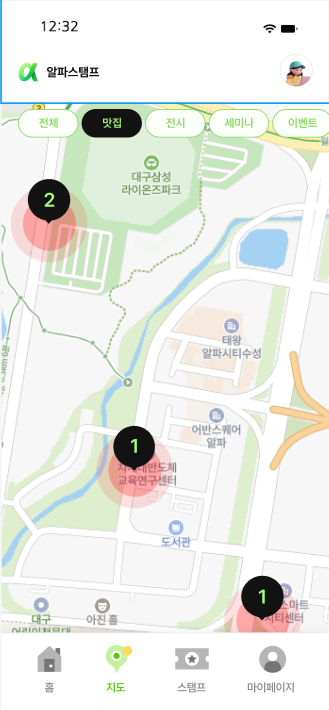
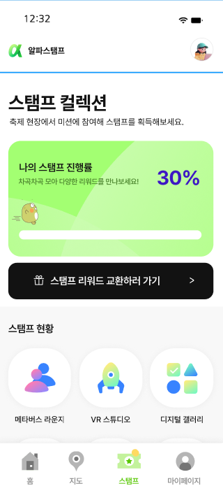

# StampTourApp

Jetpack Compose로 제작 중인 스탬프 투어 앱입니다.  
하단 네비게이션을 기반으로 홈 / 지도 / 스탬프 / 마이페이지 구조를 구성했습니다.

## 📱 App Design Preview

> 앱 디자인 및 화면 구성 미리보기

&nbsp;&nbsp;&nbsp;

&nbsp;&nbsp;&nbsp;

---

## 🛠 Tech Stack
- Kotlin
- Jetpack Compose (Material3)
- Navigation Compose

## ✨ Features
- 홈 화면
  - 메인 배너 자동 슬라이드
  - 프로그램 / 이벤트 카드 슬라이더
  - 스탬프 진행률 표시
- 하단 네비게이션
  - 홈 / 지도 / 스탬프 / 마이페이지
- 화면 구조 분리(feature 기반)

## 📂 Project Structure
